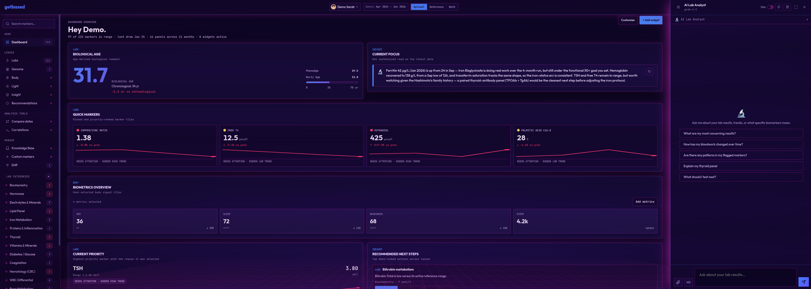

# getbased — Open-Source Health Dashboard with AI

**getbased** is a free, open-source health dashboard that turns lab PDFs into interactive charts and AI-powered health insights. Track 287+ biomarkers over time, detect trends, and get personalized interpretations — all stored locally in your browser with no account required.

**[Live app](https://app.getbased.health)** · **[Documentation](https://getbased.health/docs)** · **[Discord](https://discord.gg/zJdVB9zgQB)** · **[Nostr](https://njump.me/npub13xgjkyve82xesxxzvy52vz99z5fcuusda4cytekct2tw800kepas498nt2)**



---

## What it does

- **AI-powered PDF import** — drop any lab report (any format, language, or country) and AI extracts and maps results to 287+ known biomarkers automatically. Batch import, direct image import (JPG/PNG/WebP), auto image mode for scanned PDFs
- **Biomarker trend charts** — interactive line charts with proportional time scale, reference bands, optimal ranges, and trend detection across 17 standard categories
- **AI chat** — ask questions about your results with full health context, image attachments, multiple personalities, conversation threads
- **DNA import** — upload raw data from AncestryDNA, 23andMe, MyHeritage, FTDNA, or Living DNA. 42 curated SNPs across 10 categories (methylation, iron, lipids, vitamin D, etc.) with APOE haplotype resolution. Genetic factors shown on dashboard, detail modals, and in AI context
- **Specialty lab adapters** — OAT (165 markers), fatty acids (Spadia, ZinZino, OmegaQuant), Metabolomix+. Any other specialty test imports through the custom marker pipeline
- **Biological age** — PhenoAge (Levine 2018) + Bortz Age (Bortz 2023) combined into a unified Biological Age marker with component breakdown
- **Calculated markers** — HOMA-IR, BUN/Creatinine ratio, free water deficit, lipid ratios (TG/HDL, LDL/HDL, ApoB/ApoA-I), NLR, PLR, De Ritis ratio, hs-CRP/HDL cardiovascular risk ratio
- **Trend alerts** — sudden changes and linear regression flagged on the dashboard
- **Correlation viewer** — compare any two markers, heatmap view
- **Compare dates** — side-by-side comparison of any two lab dates
- **Manual entry** — add results without a PDF, create custom biomarkers
- **Marker glossary** — searchable reference for all markers with values and ranges
- **Interpretive lens** — frame AI analysis through specific scientific paradigms or experts
- **Custom Knowledge Source** — connect your own document collection (research papers, clinical guides, any texts) to ground AI analysis in real sources. The AI searches your knowledge base for relevant passages before interpreting your labs, and cites them back to you
- **9 lifestyle context cards** — diet & digestion, sleep, exercise, stress, light & circadian, environment, EMF assessment (Baubiologie SBM-2015), and more — each gets an AI health rating and enriches all interpretations
- **Menstrual cycle tracking** — phase-aware reference ranges, cycle phase bands on charts, perimenopause detection, symptom tracking
- **Supplement & medication timeline** — overlaid on charts to correlate with biomarker changes
- **PDF reports** — export a full health report as PDF
- **Multi-profile** — track multiple people, client list with search/sort/filter

## Privacy and data ownership

- All data stored locally in your browser (localStorage + IndexedDB) — nothing on a server
- Personal info stripped from PDFs before AI processing (regex + streaming local AI obfuscation)
- AES-256-GCM encryption at rest
- Automatic backups (IndexedDB snapshots + daily folder backup via File System Access API)
- Venice AI end-to-end encryption option — prompts encrypted client-side (ECDH secp256k1 + AES-256-GCM), decrypted only inside a TEE. Nothing readable in transit or at rest on their servers
- Run a local AI server and nothing leaves your machine at all
- No account, no sign-up, no tracking

## Agent Access

Opt-in feature that lets AI agents query your lab context — coding agents (Claude Code, Cursor), messenger bots (Hermes Agent, OpenClaw), or any MCP-compatible tool.

- Enable in **Settings → Data → Agent Access** to generate a read-only token
- Context is pushed to a lightweight gateway on every save and profile switch
- Per-profile: each profile's context is stored separately; agents can query any profile by ID
- Install on Linux with one command: `curl -sSL https://getbased.health/install.sh | bash` (`pipx install --include-deps "getbased-agent-stack[full]"` for manual / cross-platform installs). [getbased-agents](https://github.com/elkimek/getbased-agents) bundles the MCP adapter, local RAG knowledge server, and browser setup dashboard. Works with [Hermes Agent](https://github.com/hermes-agent/hermes-agent), [OpenClaw](https://openclaw.ai), Claude Code, Claude Desktop, Cursor, Cline, or any MCP-compatible agent
- Only the AI-readable context text is shared — never your mnemonic or raw lab data
- Token is revocable at any time from the same settings panel

## AI providers

| Provider | Description |
|---|---|
| **PPQ** | 300+ models, no KYC. Bitcoin, Lightning, Monero, Litecoin. Top up directly in the app. |
| **Routstr** | Decentralized Bitcoin AI. Built-in Cashu wallet, Nostr node discovery. Fund with Lightning, pick any node. |
| **OpenRouter** | 200+ models (Claude, GPT, Gemini, Grok). Pay with card or USDC. One-click OAuth. |
| **Venice AI** | Uncensored models with optional E2EE. No-log policy. |
| **Local AI** | Any OpenAI-compatible server — Ollama, LM Studio, Jan, llama.cpp. Fully offline. Free forever. |

Switch providers anytime. All non-AI features work without a provider configured.

## How it compares

| | getbased | Typical blood test apps |
|---|---|---|
| Open source | GPL-3.0 | Closed source |
| Cost | Free | Free tier + paid upsell |
| Data storage | Local browser, encrypted | Cloud (their servers) |
| AI providers | 5 choices (including fully local) | Locked to one |
| Lab import | Any PDF, any format, any language | Specific labs/formats only |
| Biomarkers | 287+ standard + unlimited custom | Limited set |
| Specialty labs | OAT, fatty acids + custom marker pipeline for any test | Blood only |
| DNA raw data | 42 curated SNPs, APOE, 5 providers | No |
| Lifestyle context | 9 cards inform all AI analysis | None or basic |
| Custom knowledge base | Bring-your-own knowledge source endpoint, any documents | No |
| Account required | No | Yes |

---

## Quick start

```bash
git clone https://github.com/elkimek/get-based
cd get-based
node dev-server.js
```

Open `http://localhost:8000`. You need an AI provider API key or local AI server for PDF import and chat. All other features work without one.

## Tech stack

Web app only — no build tools, no bundler, no package manager. Pure ES modules under `js/`.

- Chart.js for interactive charts
- pdf.js for PDF text extraction
- transformers.js + OPFS for the browser-local Lens (Custom Knowledge Source)
- Evolu for optional CRDT sync (E2E encrypted)
- Most runtime dependencies vendored in `vendor/`
- Installable as a PWA (works offline for non-AI features)

## Repo structure

```
get-based/
├── js/ styles.css index.html  # The product — static files, runs in any browser
│   ├── js/lens.js              #   Custom Knowledge Source dispatcher
│   └── js/lens-local*.js       #   Browser-local lens — MiniLM in-browser, OPFS vectors
├── tests/                      # Node-side + Puppeteer browser assertions
├── .github/workflows/          # Tests on every PR / push
└── docs/                       # User-facing documentation
```

Open `index.html` (or start `node dev-server.js` for development) and the dashboard runs.

### Related repos

- [**getbased-relay**](https://github.com/elkimek/getbased-relay) — Evolu sync relay for opt-in cross-device sync.
- [**getbased-agents**](https://github.com/elkimek/getbased-agents) — the MCP adapter for AI clients (Claude Desktop, Hermes, Cursor, etc.), a local RAG knowledge server backing the "External server" Knowledge Base, and a browser setup dashboard. Install on Linux with `curl -sSL https://getbased.health/install.sh | bash`, or manually with `pipx install --include-deps "getbased-agent-stack[full]"` on any platform.

## Testing

45 test files — node-side helpers plus Puppeteer-driven browser assertions — run headlessly:

```bash
./run-tests.sh
```

Starts a local server, runs all tests via Puppeteer, exits 0/1.

## Contributing

See [CONTRIBUTING.md](CONTRIBUTING.md). Project board: [planned features](https://github.com/users/elkimek/projects/2).

## Star History

[](https://star-history.com/#elkimek/get-based&Date)

## License

GPL-3.0. See [LICENSE](LICENSE).
